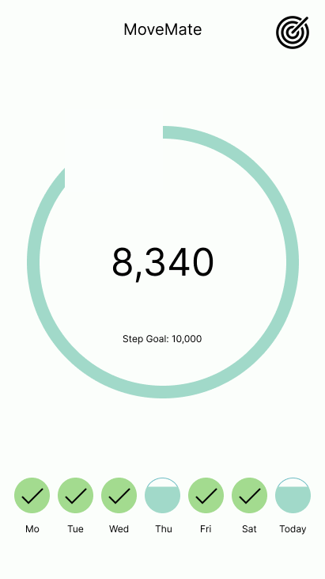
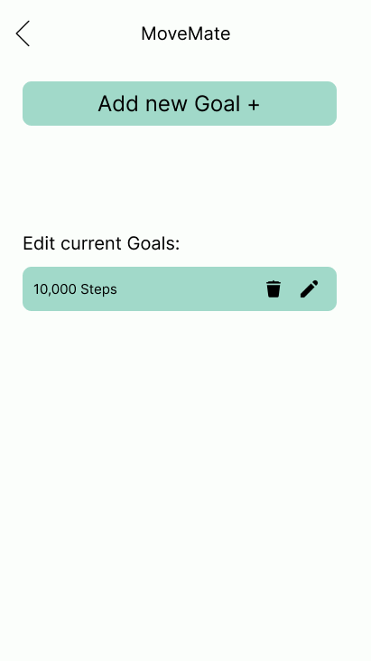
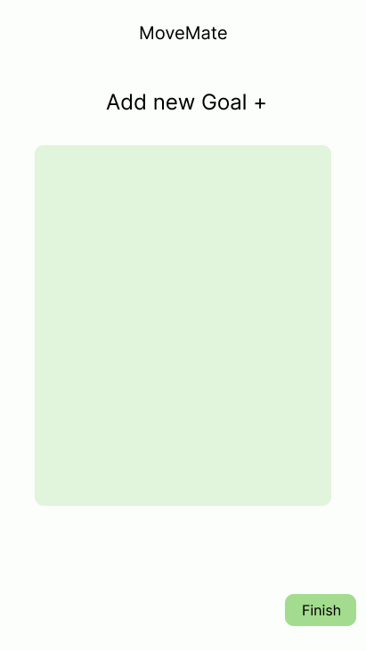
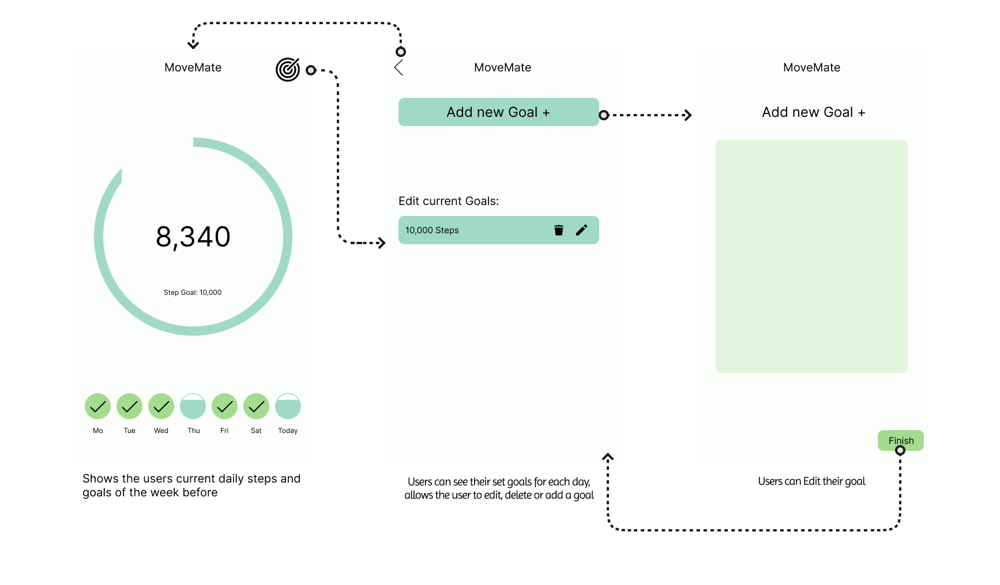

# Movemate

Movemate is a step tracker app designed to help people integrate more movement into their daily lives. Whether you're aiming for better health, weight loss, or just trying to stay active, Movemate is your companion for staying on track.

## App Concept

### Use Case
Many people today lead pretty sedentary lifestyles, often not getting enough physical activity to maintain their health. The World Health Organization (WHO) lists physical inactivity as one of the leading risk factors for major health problems like heart disease and diabetes. Movemate aims to make it easier and more engaging for people to stay active and build healthier habits. By tracking steps and encouraging users to move more, Movemate helps boost overall health and well-being.

### Target Users
- **People with sedentary jobs** who want to increase their daily movement.
- **Individuals with fitness or weight loss goals** who need a tool to track progress.
- **Health-conscious users** seeking ways to improve their daily routines and stay active.

### Similar Apps
Movemate stands alongside other popular fitness apps, but with a unique twist:
- **Google Fit**
- **Pacer**
- **Fitbit**

While these apps provide excellent tracking features, Movemate goes beyond by incorporating gamification elements to keep users engaged and motivated.

### Mockups 

### User Flow

### Gamification
We plan to add gamification features to make Movemate more fun and interactive. Instead of just showing your step count in a standard UI, Movemate introduces a **virtual pet** that thrives based on your activity:

- **Daily Goals:** Feed your virtual pet by hitting your daily step goal. Keep a streak of several days and you pet will become _buff_
- **Earning Coins:** Reach your goals to earn coins, which can be used to unlock new pets and customize your experience.
- **Long-Term Engagement:** This feature rewards consistent effort and makes staying active feel like a fun game instead of a chore.

With these features, Movemate turns step tracking into an engaging, goal-oriented experience.

### Heuristic Evaluation and Usability Test design
Notion page: 
https://freckle-buckthorn-932.notion.site/Usability-Test-Movemate-17fff580d2d2806ea7d7e71cd7020bc4 

---
