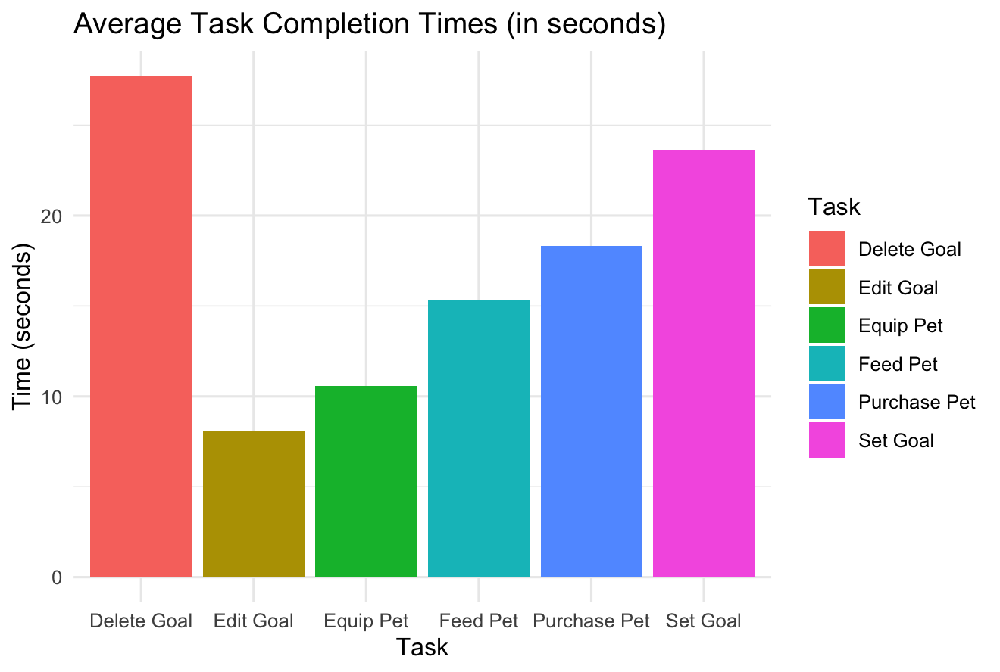
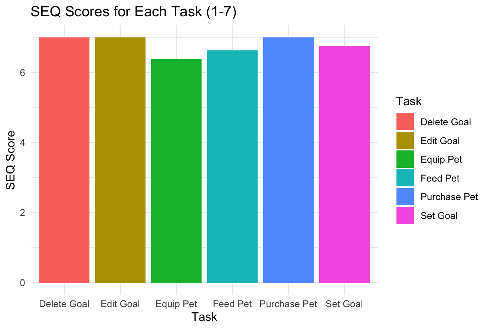

# Movemate

Movemate is a step tracker app designed to help people integrate more movement into their daily lives. Whether you're aiming for better health, weight loss, or just trying to stay active, Movemate is your companion for staying on track.

[App Concept](#app-concept) 

[Test Design](#heuristic-evaluation-and-usability-test-design)

[Test Results](#usability-test-results)

[Final App](#final-app)

## QR Code & Link

[Download Link](https://we.tl/t-0g0exgcNaF)

# App Concept

### Use Case
Many people today lead pretty sedentary lifestyles, often not getting enough physical activity to maintain their health. The World Health Organization (WHO) lists physical inactivity as one of the leading risk factors for major health problems like heart disease and diabetes. Movemate aims to make it easier and more engaging for people to stay active and build healthier habits. By tracking steps and encouraging users to move more, Movemate helps boost overall health and well-being.

### Target Users
- **People with sedentary jobs** who want to increase their daily movement.
- **Individuals with fitness or weight loss goals** who need a tool to track progress.
- **Health-conscious users** seeking ways to improve their daily routines and stay active.

### Similar Apps
Movemate stands alongside other popular fitness apps, but with a unique twist:
- **Google Fit**
- **Pacer**
- **Fitbit**

While these apps provide excellent tracking features, Movemate goes beyond by incorporating gamification elements to keep users engaged and motivated.

### Mockups 

### User Flow

### Gamification
We plan to add gamification features to make Movemate more fun and interactive. Instead of just showing your step count in a standard UI, Movemate introduces a **virtual pet** that thrives based on your activity:

- **Daily Goals:** Feed your virtual pet by hitting your daily step goal.
- **Earning Coins:** Reach your goals to earn coins, which can be used to unlock new pets and customize your experience.
- **Long-Term Engagement:** This feature rewards consistent effort and makes staying active feel like a fun game instead of a chore.

With these features, Movemate turns step tracking into an engaging, goal-oriented experience.

# Heuristic Evaluation and Usability Test design

We will evaluate our fitness app Movemate. The test aims to assess how intuitive and satisfying the app is to users, with a focus on key features, such as feeding the pet, setting a goal and purchasing an animal in the shop.

**Target Users**

Our target audience includes people of all age groups who lead mostly sedentary lifestyles and are looking to improve their walking habits. It is targeting casual users who enjoy gamified approaches and have broad fitness or weight loss goals, such as increasing daily activity. In general, our app is designed to appeal to users who seek fun, enaging tools for self-improvement.

**Hypotheses**

The pet feeding and shop features will lead to higher user satisfaction, but ultimately users will not find them engaging enough to sustain long-term usage.

The goal-setting and progress-tracking functionality will be perceived as intuitive and easy to use.

Primary Experimental Question

How usable and engaging is Movemate for completing primary tasks such as setting goals, feeding the pet and using the shop?

**Independent and Dependent Variables**

Independent Variables: 

Features being tested

- Setting and editing step goals
- Pet feeding functionality
- Shop usability, including purchasing and equipping animals

Dependent Variables:

- User satisfaction
- Perceived ease of use
- Task success rate

**Methods for Data Collection**

This test will be a descriptive usability test, conducted in person. Participants will receive a short introduction about the purpose of the app and study and subsequently a form of consent. Afterwards, participants will receive six tasks to complete, including setting a step goal, feeding the pet after achieving said step goal, editing and deleting a goal and purchasing a new pet. Each task will be followed by a Single Ease Question. During the test users are encouraged to think aloud to help us understand their thought process and highlight areas of confusion or difficulty. To conclude the study, users will fill out a SUS questionnaire.

**Data Utilization**

Qualitative Data

Observations and verbal feedback will be used to identify common points of frustration and potential improvement. Additionally, any inconsistencies between the intended functionality and user perception, or unmet expectations can be examined.

Quantitative Data

To analyse our quantitative data we will calculate average SUS and SEQ (?) scores, allowing us to determine overall usability and user satisfaction levels. Task success rates will also be taken into consideration for additional context.

**Heuristic Evaluation**

| Description | Heuristic # | Severity |
| --- | --- | --- |
| Step Goal a bit unclear (e.g. user can´t add a day if it already exists → not good error prevention) | 5 | 6 |
| Users may not understand how to earn coins | 10 | 6 |
| Deleting and editing button same design (size, color) → may lead to accidental delete | 5/3 | 4 |
| “Add Goal” written out instead of symbol | 8 | 2 |
| Completed goals may not be recognizeable as such (for past days) | 6 | 5 |
| Not every page has a back button (Add goal page) | 4 | 5 |
| If a user has not enough coins and still tries to buy a new pet, there is no error-message | 9 | 4 |

# Usability Test Results 

### **Goal:**

The goal of the user test is to uncover challenges for users and gather user feedback to further improve the app. Move Mate is a step tracker, where users can set step goals, feed their virtual pets and use coins to purchase new pets.

---

### **Test Overview**

**Participants:**

- Total: 8 participants
- Age Range: 19 to 21 years
- Gender: 5 female, 3 male
- Device Types commonly used: iPhone and Android

**Tasks Tested:**

1. Set a step goal of 5,000 steps.
2. Edit the step goal to 7,000 steps.
3. Delete the step goal entirely.
4. Feed your pet in the app after achieving the step goal.
5. Use the shop to purchase a new pet.
6. Equip the newly purchased pet.

→ After each task users had the chance to write their thoughts on the task and had them answer the Single Easy Question (SEQ)

---

### **Quantitative Results**

### **Task Completion Times (in seconds):**

- Task 1 (Set Goal): Average 23.65s
- Task 2 (Edit Goal): Average 8.12s
- Task 3 (Delete Goal): Average 27.70s
- Task 4 (Feed Pet): Average 15.31s
- Task 5 (Purchase Pet): Average 18.31s
- Task 6 (Equip Pet): Average 10.58s
    
    

### **SEQ (Single Ease Question) Scores (1-7):**

- Task 1 (Set Goal): 6.75
- Task 2 (Edit Goal): 7.0
- Task 3 (Delete Goal): 7.0
- Task 4 (Feed Pet): 6.63
- Task 5 (Purchase Pet): 7.0
- Task 6 (Equip Pet): 6.38
    
    
    

### **SUS (System Usability Scale) Score:**

- Average SUS Score: **76.56**
    - Interpretation: Above-average usability. A score above 68 is considered good.

---

### **Key Findings from Qualitative Feedback**

### **Strengths:**

1. **Pet Feature Appeal:** Participants loved the idea of feeding virtual pets and described them as "cute" and engaging.
2. **Goal Setting:** Most users found the step goal feature straightforward and easy to use.
3. **Shopping Experience:** Participants reported that purchasing pets in the shop was intuitive and smooth.

### **Challenges Identified & Ideas**

1. **Calendar or Weekly Goals:** Some participants mentioned the lack of options for setting weekly goals or integrating with a calendar.
2. **Visual Guidance:** One participant suggested that additional visual cues or tooltips could make the pet feeding process clearer.
3. **Notification Feature:** Feedback suggested the inclusion of reminders or notifications for pet feeding and achieving step goals.
4. **New Pet Mechanics:** Introduced a feature where pets can become "angry" or even "disappear" if they are not fed for a prolonged period, encouraging consistent user engagement.
5. **Workout Mode:** Added a "Workout Mode" option where users can set time-based and step-based goals to earn extra coins as a reward for completing their workouts.

---

### **Updates Made Based on Feedback**

1. **UI Enhancements:** Improved Visual Design, especially colors
    

    
    Old Color Scheme
    
    
    Updated Color Scheme
    
2. **New Pet Mechanic:** If the users do not complete their step goals for some time, the pet will fall asleep and can only be awaken by walking a set amount of steps. The state of sleeping will last until the step goal is reached.
3. **Information Button:** Since a lot of test users did not know how the app worked, we added a button to display some information (e.g. on how to earn coins)

---

### **Conclusion**

Move Mate demonstrates strong usability with an above average SUS score of 76,56. There is definetely the possibility of a ceiling effect, since the SEQ scores where quite high. Since the app was made within two weeks and the app does not have the same amount of features as an app made by a big company. The tasks were quite easy, but we still got a lot of important insights and suggestions for improvement.

---

# Final App

## Animations
These are the different animations we implemented into our app. 
We have:
- an idle animmation which plays whenever the user opens the app
- a workout animation, which plays for four seconds after the user fed the pet
- a sleeping animation, which plays when a user did not achieve their goal for several days, which puts the pet into a deep sleep and the user has to complete a certain step goal to wake it up again

The dog is the default pet, the others can be unlocked by paying 20 coins

